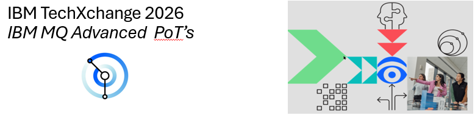

## What is IBM MQ?

You can use IBM MQ to enable applications to communicate at different times and in many diverse computing environments.

IBM MQ is messaging for applications. It sends messages across networks of diverse components. Your application connects to IBM MQ to send or receive a message. IBM MQ handles the different processors, operating systems, subsystems, and communication protocols it encounters in transferring the message. If a connection or a processor is temporarily unavailable, IBM MQ queues the message and forwards it when the connection is back online.
An application developer has a choice of programming interfaces, and programming languages to connect to IBM MQ.

|  Topic                                     | Description                                                                
|--------------------------------------------|-----------------------------------------------------------------------------|
| [MQ Advanced](https://pages.github.ibm.com/americas-integration/MQ-Advanced-pot/){:target="_blank"}         | This section you will tap into the value of existing data flowing over MQ with zero impact to the existing applications or their messages, and without a need for re-architecture your message flows. 
|--------------------------------------------|-----------------------------------------------------------------------------|  
| [MQ Appliance](https://ibm-cloudintegration.github.io/MQ-Appliance-PoT-9.4/){:target="_blank"}      |  The IBM MQ Appliance provides a simplified messaging solution by combining many of the benefits of IBM MQ with those of a physical appliance. Like IBM MQ, the IBM MQ Appliance provides a rapid, reliable, security-rich infrastructure, but unlike IBM MQ, it combines software with hardware.  
|--------------------------------------------|-----------------------------------------------------------------------------|
| [MQ Availability(RDQM 9.3)](https://pages.github.ibm.com/americas-integration/MQ-Availability-PoT/){:target="_blank"}       |  MQ Replicated Data Queue Manager (RDQM). This technology is based on the MQ Appliance high availability capabilities, and is available on the Linux operating system. When comparing to multi-instance, there are three key differences: **No shared disk, Quorum based, Floating IP**
|--------------------------------------------|-----------------------------------------------------------------------------|

